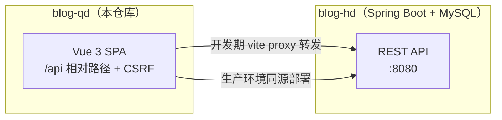

# blog-qd

[](LICENSE)
[](package.json)
[](.github/workflows/ci.yml)

个人博客的前端：Vue 3 + Vite，玻璃拟态界面，不依赖任何 UI 组件库，亮暗主题由 CSS 变量驱动。文章、相册、留言等数据由配套的 Spring Boot 后端提供。

## 界面预览

<table>
  <tr>
    <td width="50%"></td>
    <td width="50%"></td>
  </tr>
  <tr>
    <td></td>
    <td></td>
  </tr>
</table>

## 功能

- **首页** — 站点统计、文章列表、进站访问上报
- **文章** — 分类筛选、代码高亮、站内评论（服务端分页）
- **归档** — 年份轨道筛选 + 365 天写作热力图
- **随笔 / 相册** — 时间流图文、照片墙
- **留言板** — 分页加载、点赞、回复，游客可发
- **项目** — 后端数据驱动的项目列表与详情，README 全文渲染
- **简历** — 口令解锁，正文只在解锁后从服务端拉取（不打包进前端）
- **账号** — 注册 / 登录 / 注销，服务端会话 + CSRF 双保险
- **全站** — 导航搜索、亮暗主题、行为上报（仅记录有意义的行为，无第三方统计）

## 技术栈

Vue 3 · Vue Router 5 · Pinia · Vite 8 · markdown-it · highlight.js

质量工具：oxlint + ESLint + Prettier + EditorConfig

## 架构



开发期所有 `/api` 请求由 Vite 代理转发到本机 8080 的后端（见 [`vite.config.js`](vite.config.js) 的 `server.proxy`）；生产环境前后端同源部署，无需跨域配置。

## 快速开始

前提：Node.js `^22.18.0 || >=24.12.0`，以及跑在 `localhost:8080` 的配套后端（默认约定，可在 `vite.config.js` 里改）。

```sh
npm install
npm run dev
```

只起前端不连后端也能看到界面，但列表类页面会提示网络错误——数据全部来自后端。

### 构建

```sh
npm run build     # 产物输出 dist/
npm run preview   # 本地预览构建产物
```

### 代码检查与格式化

```sh
npm run lint     # oxlint + eslint，自动修复可修复项
npm run format   # prettier 格式化 src/
```

## 定制

改这三处就能变成你自己的博客：

| 位置 | 内容 |
| --- | --- |
| [`src/config/links.js`](src/config/links.js) | 页脚与导航的 GitHub / Gitee / GitLab 外链 |
| [`src/views/AboutView.vue`](src/views/AboutView.vue) 顶部 `AUTHOR` | 关于页的人设：姓名、头衔、城市、邮箱 |
| [`index.html`](index.html) + `src/router/index.js` | 站点标题 |

站点级配置（各页面背景素材等）由后端 `/api/site` 下发，未配置时回落本地素材。

## 目录结构

```
src/
├── api/          # 全站唯一的请求封装：fetch + CSRF + 统一错误
├── assets/       # 本地图片、视频、全局 CSS 变量
├── components/   # 导航栏、搜索弹窗、热力图等通用组件
├── composables/  # 主题等组合式函数
├── config/       # 外链、本地存储 key
├── router/       # 路由与标题、行为上报
├── stores/       # Pinia：登录态、站点配置
├── utils/        # 头像生成等工具
└── views/        # 13 个页面组件
```

## License

[MIT](LICENSE)
